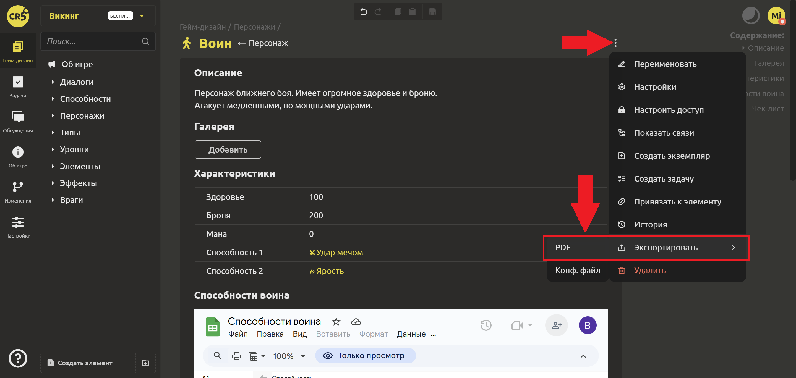
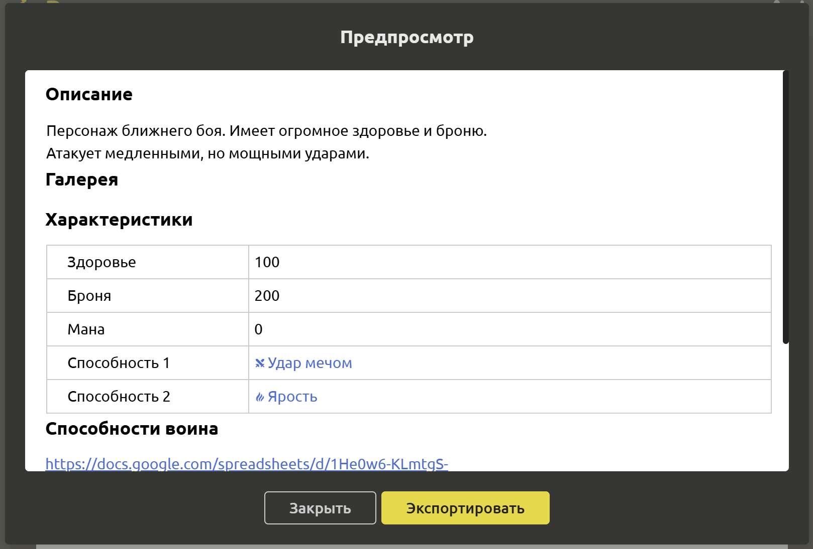
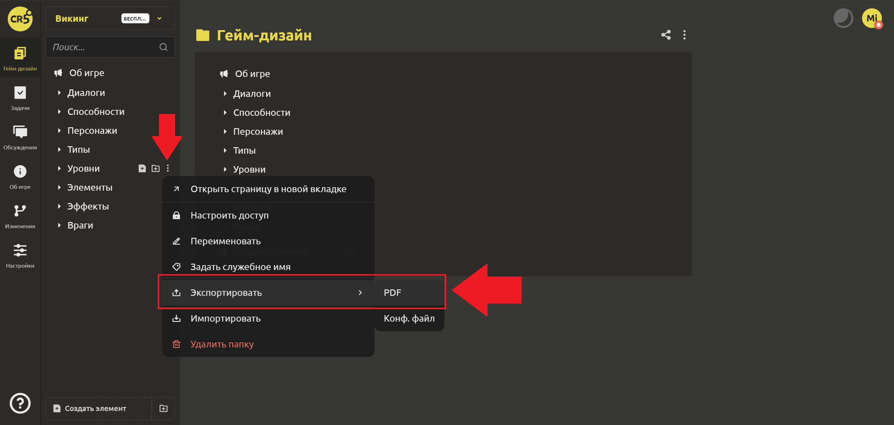
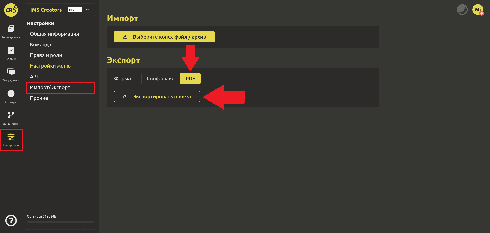

# Импорт и экспорт

## Экспорт

В IMS Creators Вы можете экспортировать в PDF:

1. Отдельный элемент. Для этого выбираем в меню в правом верхнем углу либо во вкладке “Гейм-дизайн” команду `Экспортировать` и формат “PDF”.

Появится окно предварительного просмотра. После проверки, что всё верно, нажмите `Экспортировать`.

2. Папку. Необходимо выполнить те же самые действия.

3. Весь проект. Переходим на вкладку “Настройки” -> “Импорт/Экспорт”. 

Аналогично Вы можете [экспортировать конфигурационные файлы в формате JSON](../integration/export-config-files.md) для использования их в движках или при импорте. 

## Импорт

В IMS Creators Вы можете импортировать конф.файлы. Для этого выбираем в меню в правом верхнем углу либо во вкладке “Гейм-дизайн” команду `Импортировать` и находим нужный архив.
