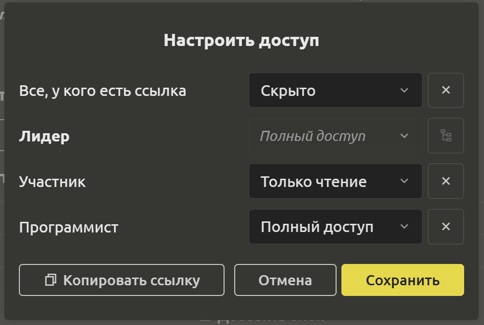

# Настройка доступа

Делитесь ссылками на задачи, файлы и даже папки, не беспокоясь об утере или утечке данных. Для того, чтобы делать это безопасно, настраивать права доступа к отдельным задачам, файлам и папкам может только лидер проекта.

## Создание ссылки для доступа

В меню, рядом с 3 точками расположен значок “Поделиться”, при нажатии на который открывается диалоговое окно, где напротив каждой роли можно выбрать доступ к элементу. На данный момент доступно 3 варианта: “Скрыть”, “Только чтение” и “Полный доступ”.

## Настройка доступа по ролям

Если нужно изменить доступ, то при клике на 3 точки выберите пункт `Настроить доступ`. Вы можете назначить каждому участнику свою роль. Более подробно о ролях и правах [здесь](../project-settings/rights-and-roles.md#права-и-роли).