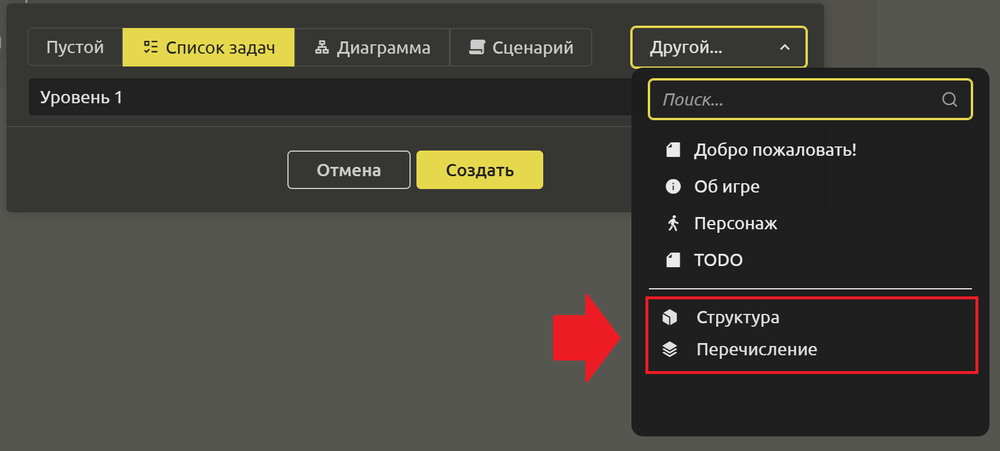
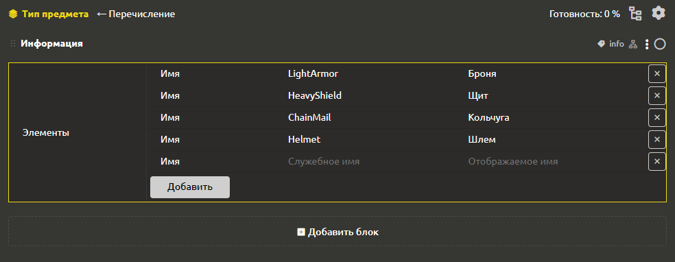
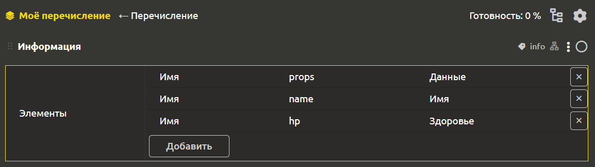
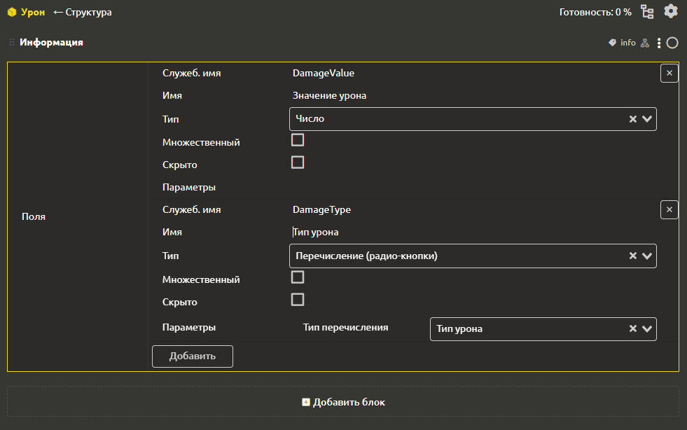
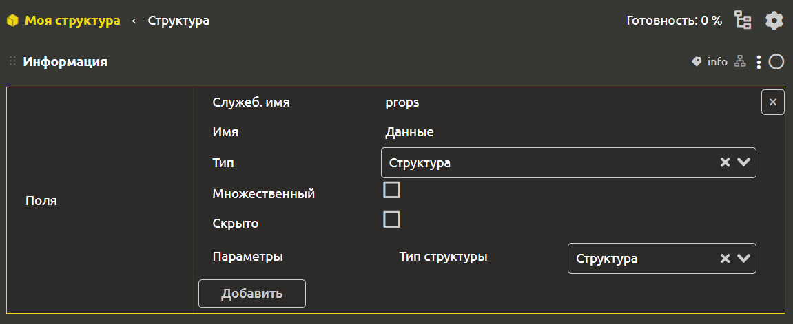

# Структуры и перечисления

Для создания структуры или перечисления необходимо создать элемент с соответствующим типом. Для этого в окне создания элемента следует кликнуть на кнопку в правом верхнем углу `Другой` и в выпадающем списке выбрать `Структура` или `Перечисление`.

## Перечисления

Тип `Перечисления` позволяет создать некий список значений, который потом можно использовать при заполнении свойств элементов. 

Например, в игре есть инвентарь с предметами. Предмет может быть одним из следующих типов: “Броня”, “Щит”, “Кольчуга”, “Шлем” и т.д. Чтобы при заполнении информации об очередном предмете случайно не опечататься (и не придумать еще один новый тип), ты можешь создать перечисление “Тип предмета” и привязать его к полю “Тип” у предмета.

Можно сделать выбор как через выпадающий список (если вариантов много), так и через переключатели (“радиокнопки”).

Внутри перечисления можно размещать список элементов. У каждого поля есть следующие параметры:
- `Имя`
- `Служеб. имя`

## Структуры

Представим, что в игре урон может быть разных видов. При задании характеристик мало указать значение урона, нужно, чтобы было еще указано, какой это урон. Накрутим еще больше, пусть одновременно можно наносить урон разных типов, например, 10 рубящего урона и 5 огненного. Здесь и пригодятся множественные структуры.

Создадим структуру “Урон” и добавим в нее два поля: “Значение урона” (число) и “Тип урона” (перечисление).

Теперь мы можем предмету “Огненный меч” задать наносимый урон, как множественное поле с типом “Структура Урон” и задать туда два значения: 10 рубящего урона и 5 огненного.

Внутри структуры можно создавать поля. У каждого поля есть следующие параметры:
- `Служеб. имя`
- `Имя`
- `Тип`. Тип может быть абсолютно любым (число, текст, дата, файл ... и даже элемент ГДД).
- `Множественный`
- `Скрыто`

