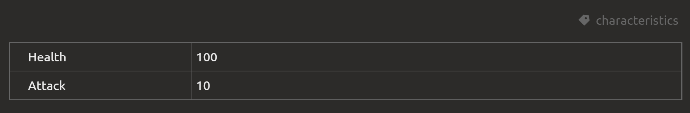

# Экспорт конф. файлов

Элементы экспортируются в JSON [следующей структуры](config-file-structure.md#структура-конф-файла).

Мы рекомендуем назначать важным блокам служебные имена. Тогда их значения будут вставляться в поле `values` объекта. Структура поля зависит от типа блока

Например, вы создаете описание некоторого персонажа, которому хотите задать два атрибута: `health` (жизни) и `attack` (сила аттаки). Для этого создаете блок "Таблица свойств" с двумя полями:



Задаете ему служебное имя `chracteristics`. Тогда в `values` у элемента будет:

```json
  "values": {
     "characteristics": {              
        "health": 100
        "attack": 10
     },
  },
```

::: tip
Чтобы назначить блоку служебное имя, нажмите на три точки в правой части блока
:::

Обратите внимание, что введенное имя поля было "нормализовано": буквы верхнего регистра заменены на нижний, убраны служебные символы, пробелы заменены на знаки подчеркивания

::: tip
Вы можете писать названия свойств и на русском. При необходимости можно переопределить имена свойств, задав им служебные имена
:::

::: warning
Обратите внимание, что по умолчанию все поля в таблице не типизированы, поэтому в зависимости от того, что будет введено в поле, вы можете получать разные типы значений в JSON. Чтобы это предотвратить, задайте нужный тип в настройках поля
:::
