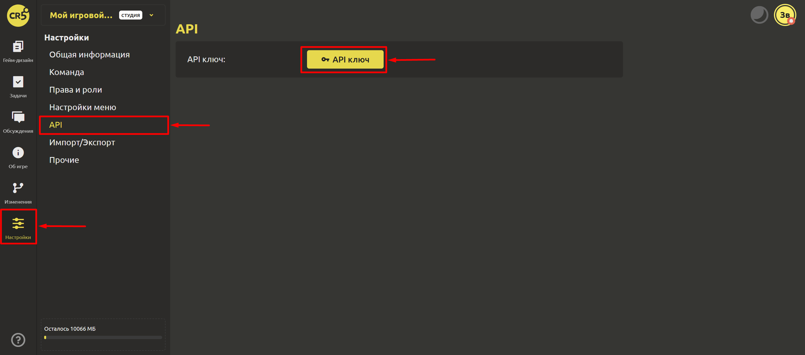
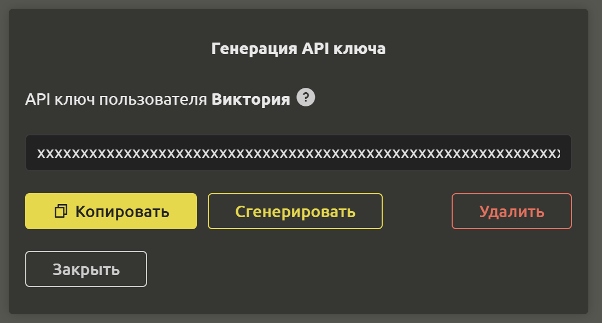

# API

::: tip
Данная функция доступна только обладателям лицензии "**Студия**". Приобрести лицензию можно [здесь](https://ims.cr5.space/app/prices).
:::

API нужен для быстрого входа в приложение. Для того, чтобы его сгенерировать, перейдите в раздел “Настройки” и выберите пункт “API”. Кликните на кнопку `API ключ`.

Откроется диалоговое окно, где можно сгенерировать новый API ключ, скопировать или удалить существующий. 

