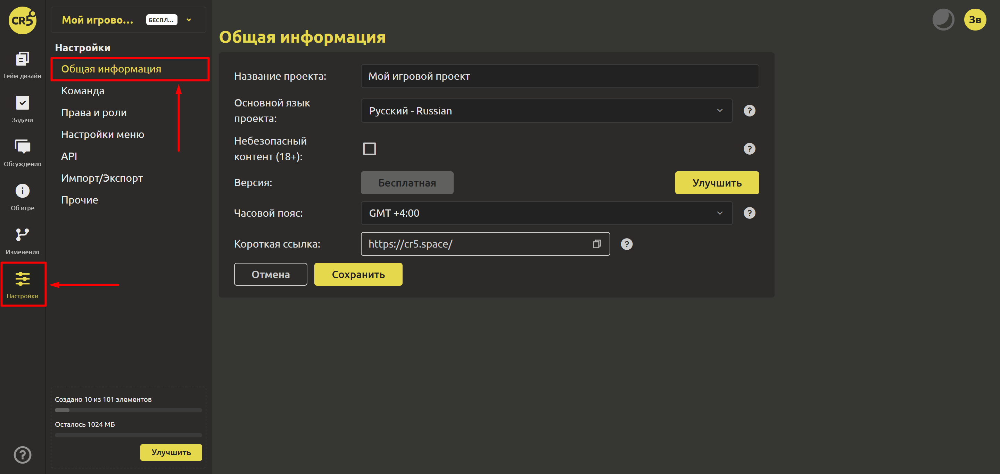

# Общая информация

Для того, чтобы изменить общую информацию о проекте, перейдите в раздел “Настройки” и выберите пункт “Общая информация”.

1. **Название проекта**  
   В этом поле указано название вашего проекта. Вы можете изменить его, кликнув на поле и введя новое название.

2. **Основной язык проекта**  
   Здесь отображается основной язык, на котором создан проект. Если вам нужно изменить язык, выберите соответствующий вариант из выпадающего списка.

   ::: tip
      Основной язык используется для генерации событий пульса и влияет на региональную выдачу общего списка проектов
   :::

3. **Небезопасный контент (18+)**  
   Этот раздел обозначает, содержит ли проект контент для взрослых. Если проект включает такой контент, поставьте галочку. В противном случае оставьте поле пустым.

4. **Версия**  
   Здесь отображается текущая лицензия проекта. Вы можете улучшить её, нажав на соответствующую кнопку.

   ::: tip
   Доступные лицензии можно найти [здесь](https://ims.cr5.space/app/prices).
   :::

5. **Часовой пояс**  
   Это временная зона по-умолчанию для проекта. Установите часовой пояс, в котором работает проект.

6. **Короткая ссылка**  
   Введите или вставьте короткую ссылку на ваш проект. Это позволит выбрать запоминающуюся ссылку для Вашего проекта.

Нажмите кнопку `Отмена`, если хотите отменить внесенные изменения и вернуться к предыдущим настройкам. Нажмите `Сохранить`, чтобы сохранить все внесенные изменения в разделе "Общая информация".