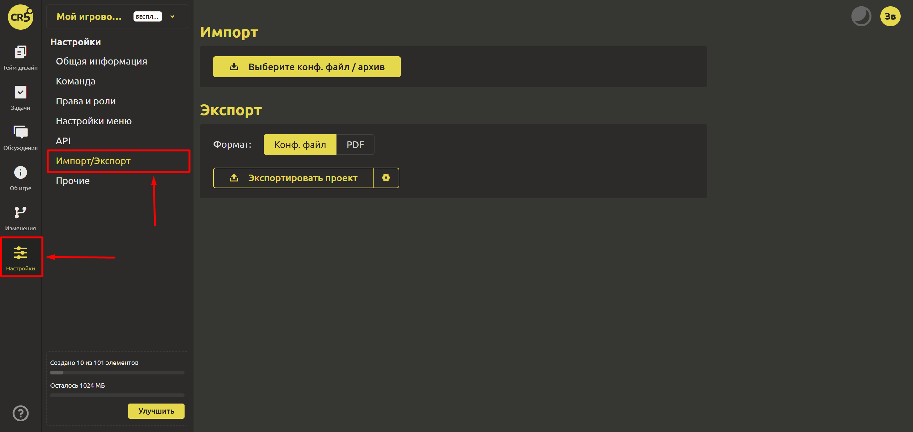

# Импорт/Экспорт

Для того, чтобы быстро начать работу или сохранить/восстановить резервную копию можно использовать функцию экспорта/импорта проекта. Для этого перейдите на вкладку "Настройки" и выберите "Импорт/Экспорт".

Экспортировать проект можно в 2 форматах:
1. [Конфигурационный файл](../integration/export-config-files.md)
2. [PDF](../gdd/import-export.md#импорт-и-экспорт)

При экспорте в виде конфигурационного файла можно задать следующие настройки:
- Использовать имена
- Сохранить структуру папок

При экспорте в PDF доступен предпросмотр.

При импорте необходимо выбрать конфигурационный файл/архив.