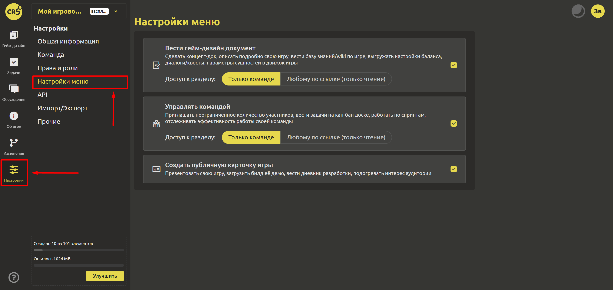

# Настройки меню

В зависимости от цели использования (ведение ГДД, управление командой, создание публичной карточки игры, а может быть все вместе) при создании проекта Вы устанавливали, какие разделы меню показывать, а какие нет. В разделе "Настройки меню" Вы можете изменить свой выбор. 

Если Вы хотите добавить раздел, то поставьте соответствующую галочку.

Здесь же Вы можете изменить публичность выбранных разделов:
- Только команде
- Любому по ссылке (только чтение)

Текущий статус публичности подсвечивается цветом.