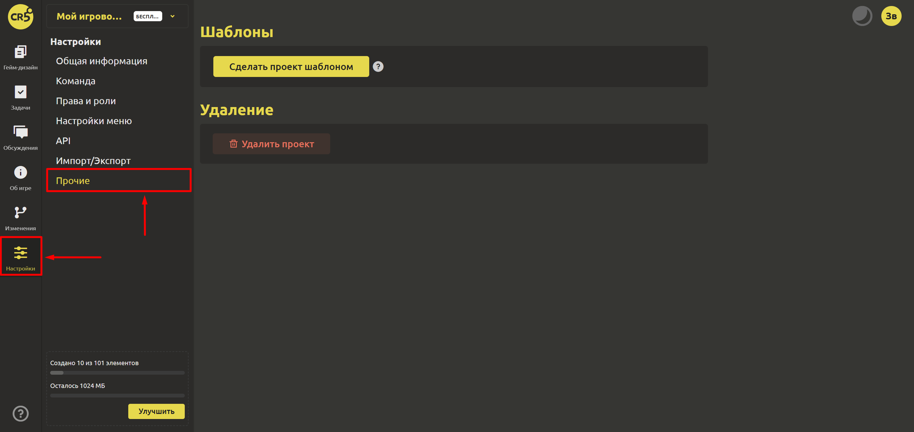

# Прочие

В разделе "Настройки" кликните на пункт "Прочие".

Здесь Вы можете `Сделать проект шаблоном`, нажав на соответствующую кнопку.

::: warning
Внимание! Действие необратимо.
:::

Шаблоны позволяют задавать структуру элементов, которая будет автоматически создаваться при использовании этого шаблона. Если нужно, чтобы элемент использовался как базовый, но его экземпляр сразу не создавался, пометьте его абстрактным в настройках элемента.

При обновлении элементов в шаблоне изменения автоматически переносятся в проекты, которые созданы на основе этого шаблона, однако новые экземпляры автоматически создаваться не будут. Для того, чтобы структура пересоздалась, в проекте, созданном на основе шаблона, необходимо нажать кнопку `Пересоздать структуру шаблона`.

Если Вы хотите удалить случайно созданный проект, то Вы можете `Удалить проект`.

::: warning
Внимание! Действие необратимо. Для подтверждения удаления введите название игрового проекта в поле ниже.
:::