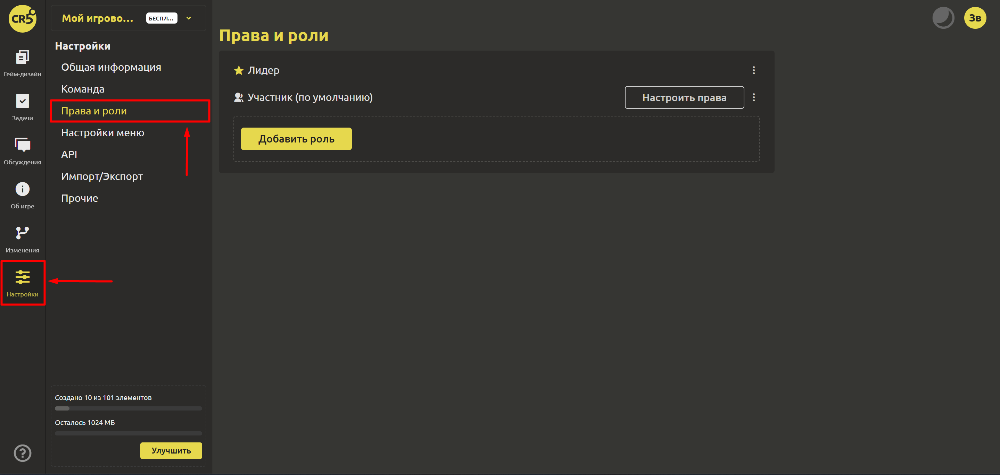
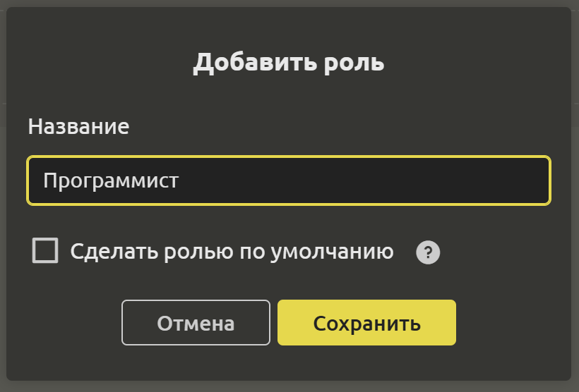
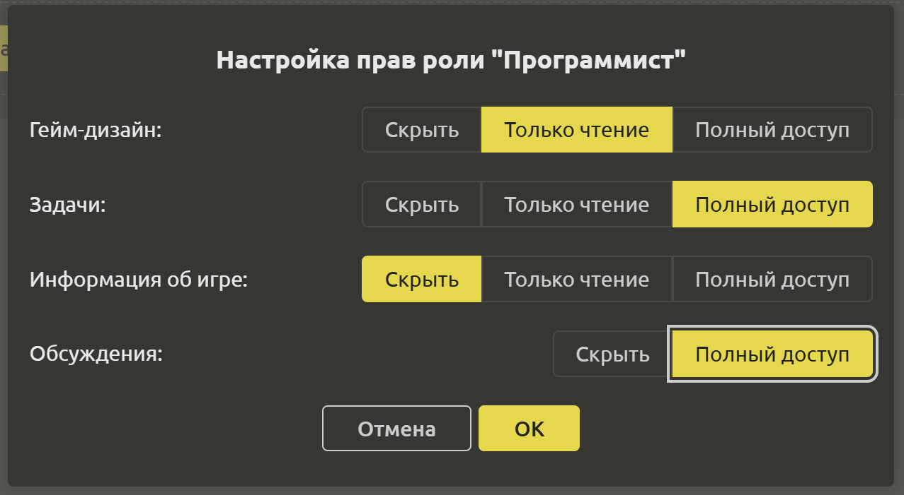

# Права и роли

Каждый участник играет свою роль в проекте и обладает определенными правами. Для того, чтобы ограничить доступ к некоторым разделам игрового проекта, Вы можете создавать роли и настраивать права (с помощью кнопки `Настроить права`).

Для создания роли используйте кнопку `Добавить роль`. При добавлении роли в открывшемся диалоговом окне нужно указать название роли и при необходимости установить флажок "Сделать ролью по умолчанию". Если установить роль по умолчанию, то все новые участники проекта будут иметь эту роль.

После создания роли нужно указать уровень доступа (`Скрыть`,`Только чтение`,`Полный доступ`) к следующим разделам:
- Гейм-дизайн
- Задачи
- Информация об игре
- Обсуждения

