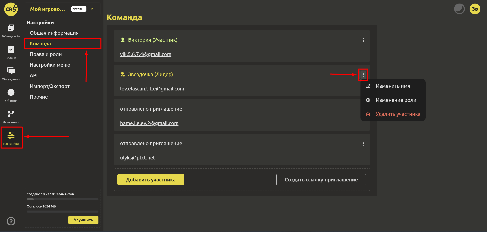
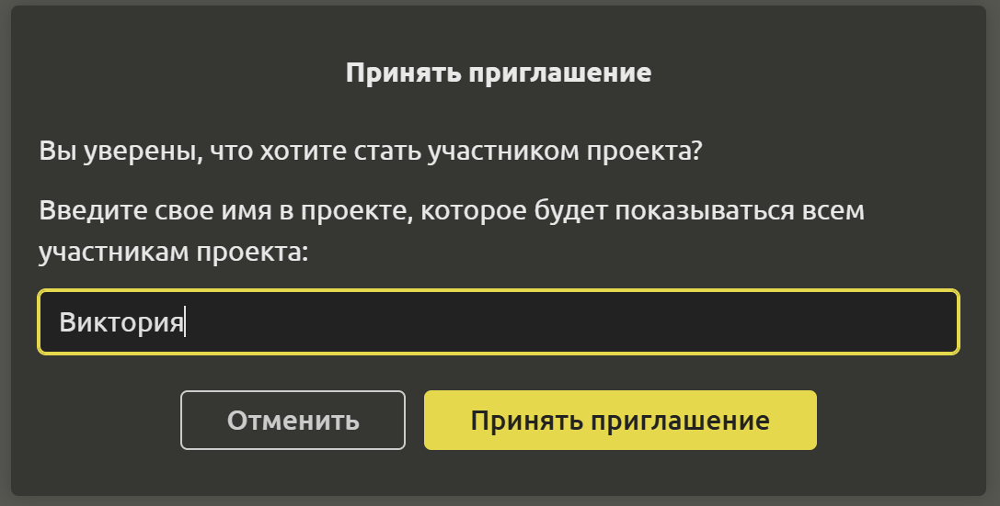

# Команда

Для того, чтобы управлять участниками, перейдите в раздел “Настройки” и выберите пункт “Команда”.

Вы можете [как добавлять новых участников](../start/invitation-to-team.md#приглашение-в-команду), так и удалять, используя выпадающее меню.

При принятии приглашения новым участникам дается возможность выбрать имя в проекте, которое будет показываться всем участникам проекта.

Используя выпадающее меню, вы можете изменить имя, а также роль. Подробнее о ролях можно узнать [здесь](./rights-and-roles.md#права-и-роли).