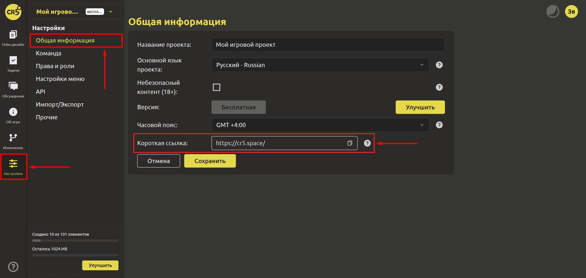

# Ведение дневника разработки

## Создание постов

Для создания постов нужно перейти на страницу `Пульс`. И в верхней части вместо `Что нового?` добавить текст. А с помощью кнопок в правой части добавить картинки и ссылки на видео, чтобы сделать слайдер. После того, как пост будет готов, нажмите кнопку `Отправить`.

Для редактирования или удаления поста можно воспользоваться меню в правом верхнем углу поста, выбрав соответствующий пункт. Пользователи могут оставлять реакции на тот или иной пост, кликнув на смайл и выбрав нужное.

## Приглашение игроков на свою страницу

Для проектов с лицензиями INDIE и STUDIO доступна возможность работать с короткой ссылкой. На вкладке `Настройки` -> `Общая информация` лидер может создать короткую и запоминающуюся ссылку для проекта.

Перейдя по ссылке ваши потенциальные игроки увидят только разделы, которые отмечены галочками.