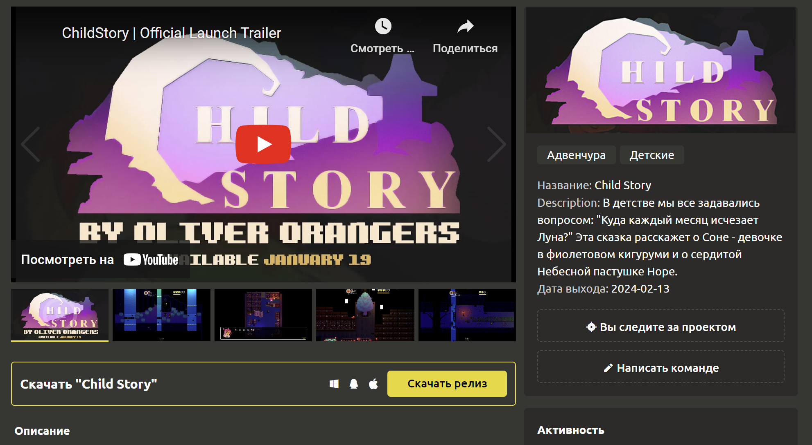
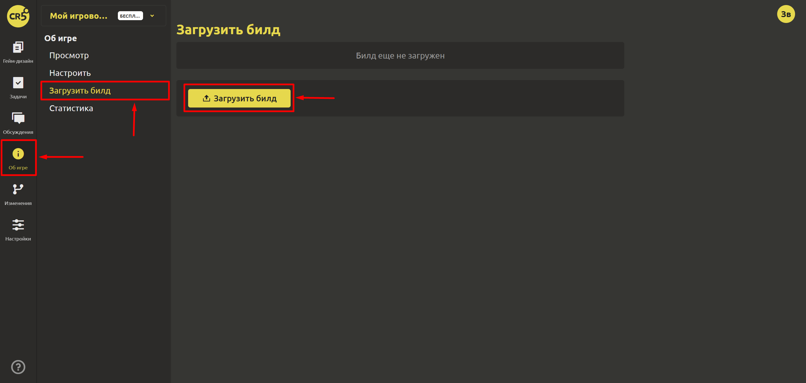
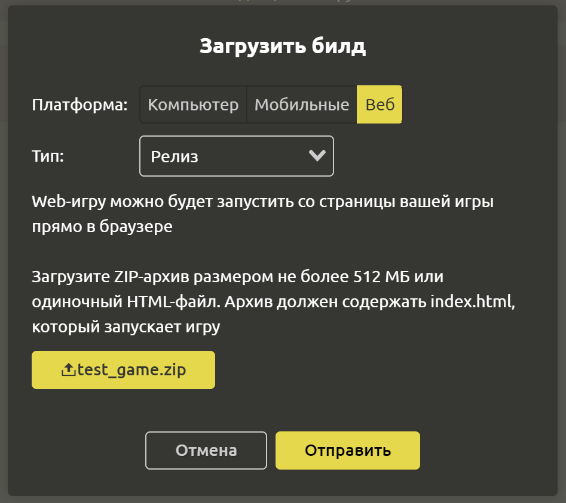
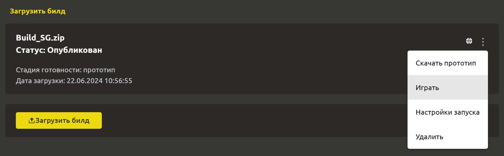
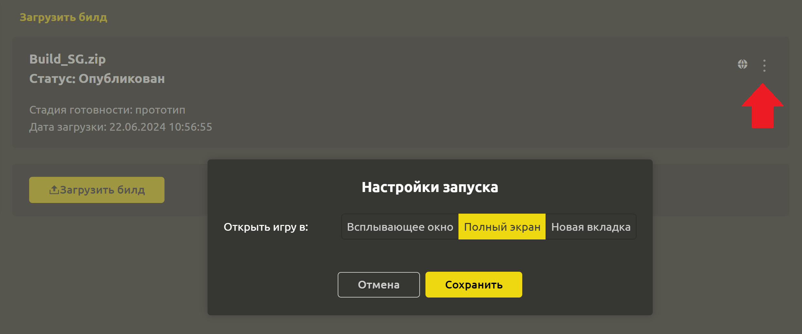

# Публикация билда

Если Ваша игра уже жизнеспособна, то её стоит показать миру) Чтобы еще больше завлечь Ваших игроков, на страницу “Об игре” Вы можете загрузить прототип, демо и даже релиз игры.

## Загрузка билда

::: warning
Публиковать билды может только **Лидер** команды. 
:::

Для этого лидеру команды нужно перейти в раздел `Об игре`->`Загрузить билд` и нажать кнопку `Загрузить билд`. 

После чего открывается диалоговое окно, где нужно выбрать платформу, стадию готовности (тип), файл и другие настройки. После заполнения нажмите кнопку `Отправить`.

::: warning
Одновременно у вас может быть загружен только один билд. После загрузки нового билда старый автоматически удаляется
:::

## Технические требования для билда

| Платформа       | Компьютер | Мобильные | Веб |
| --------------- | --------- | --------- | --- |
| Допустимые типы | “Прототип”, “Демо” или “Релиз” | “Прототип”, “Демо” или “Релиз” | “Прототип”, “Демо” или “Релиз”|
| Операционная система | Windows, Linux Mac | Android | – |
| Размер файла    | не более 5 ГБ | не более 5 ГБ | не более 512 МБ |
| Допустимые расширения файла | .zip |  .apk | .zip .html |

## Проверка билда для Веб

Вы можете загружать игры для компьютера, мобильные (APK для андроида) и даже веб. Если вы загружаете билд для веб, то Вы сразу же можете протестировать игру. Для этого откройте меню билда и кликните на пункт `Играть`. Откроется диалоговое окно на весь экран, которое можно закрыть только с помощью крестика в правом верхнем углу.

Режим открытия игры можно задать в настройках билда (пункт `Настройки запуска` в меню). Можно выбрать:
- Запуск во всплывающем окне (по умолчанию)
- Запуск в полноэкранном режиме
- Запуск в отдельной вкладке

## Рекомендации по загрузке WEB-игр

Если у вас фиксированное разрешение экрана игры, то включите режим запуска в полноэкранном режиме

Если вы используете движок **Godot 4**, то для корректной работы, либо включите режим запуска игры в отдельной вкладке, либо отключите в настройках экспорта многопоточный режим (доступно с версии 4.3):

