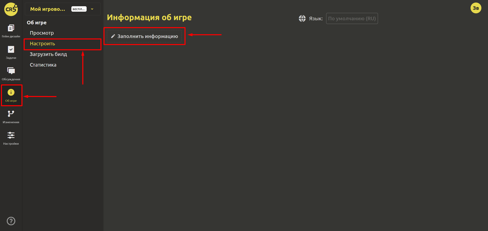

# Настройка страницы “Об игре”

Для того, чтобы добавить информацию на страницу "Об игре" необходимо перейти на вкладку `Об игре`, выбрать пункт `Настроить` и нажать на кнопку `Заполнить информацию`.

## Шаг 1. Общая информация

Необходимо заполнить общую информацию об игре (все поля можно изменить в любой момент):

- `Жанр`. Вы можете выбрать несколько жанров из предлагаемого списка.
- `Разработчик`. Введите Ваше имя или имя команды.
- `Дата выхода`.
- `Обложка`. Выберите файл (460x215) для обложки игры. Этот файл будет использоваться на странице space и в карточке каталога.
- `Описание`. На странице каталога внутри карточки игры будет указываться данное описание.

## Шаг 2. Ссылки

Если у Вас есть соцсети либо платформы, на которые уже выложена игра, то Вы можете разместить информацию в блоке `Ссылки`. Вам следует нажать на кнопку `Добавить` и в открывшемся окне указать название ссылки (например, VK, Telegram и т.п.) и саму ссылку.

## Шаг 3. Локализация

IMS Creators рассчитан на пользователей по всему миру, поэтому пока Вы можете создать 2 версии страницы об игре: на русском и на английском.

Создайте необходимые блоки таким образом, чтобы имя блока включало в себя 2 части (на русском и на английском). Например, "ABOUT THIS GAME / ОБ ЭТОЙ ИГРЕ", "SYSTEM REQUIREMENTS / СИСТЕМНЫЕ ТРЕБОВАНИЯ" и т.п.

После этого в правом верхнем углу выберите русский язык и нажмите на кнопку "Заполнить информацию". Будет создан дочерний элемент и все блоки будут скопированы. Осталось добавить информацию в созданные блоки. Когда версия на русском будет готова выберите английский язык в правом верхнем углу и нажмите на кнопку "Заполнить информацию". Будет создан элемент, наследуемый от версии на русском языке. Вся информация будет заполнена.

## Шаг 4. Галерея

Сначала добавьте картинки в галерею в английской версии, а потом в русской. Готово!

