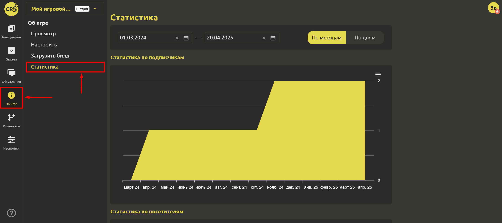

# Просмотр статистики сообщества

Для того, чтобы посмотреть статистику сообщества необходимо перейти на вкладку `Об игре`->`Статистика`.

Для получения подробной информации Вы можете указать параметры статистики:

- Рассматриваемый период (с какого по какое число)
- Способ отображения (по месяцам/по дням)

В IMS Creators доступны:

- Статистика по подписчикам
- Статистика по посетителям
- Статистика по просмотрам
- Статистика по скачиваниям
- Статистика по уникальным скачиваниям
