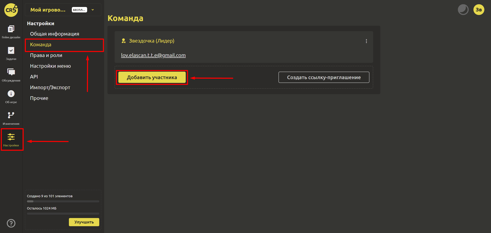
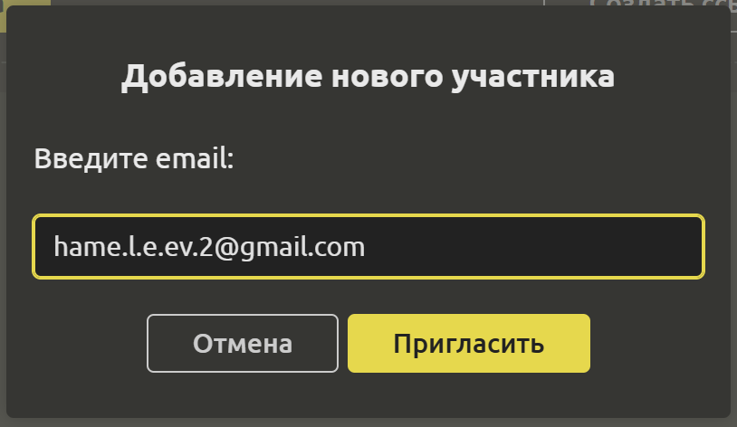
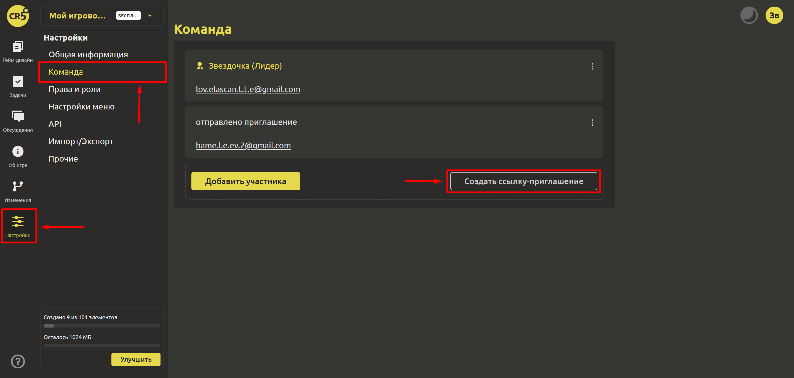

# Приглашение в команду

Работать над проектом лучше в дружной команде. В IMS Creators нет ограничения на количество участников команды. Так давайте же пригласим в наш проект единомышленников. Приглашать в проект можно и по почте, и по ссылке приглашению. 

## Приглашение по почте

В левом меню выберите раздел "Настройки"->"Команда" и нажмите `Добавить участника`.

Откроется диалоговое окно, где необходимо ввести email нового участника.

Готово! Осталось только дождаться, когда новый участник перейдет по ссылке из письма, отправленного на почту.

## Создание ссылки-приглашения

Если у Вас уже сформирована команда, то можно создать ссылку приглашение и закинуть её в группу, чтобы все участники быстро перешли по ней и стали частью большой и дружной команды в системе IMS Creators.

В левом меню выберите раздел "Настройки"->"Команда" и нажмите `Создать ссылку приглашение`.

Ссылку можно скопировать. После того, как все члены команды перешли по ссылке, её можно удалить.