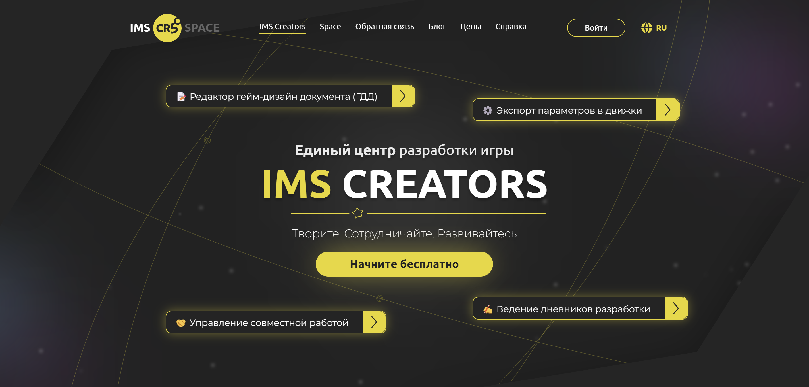
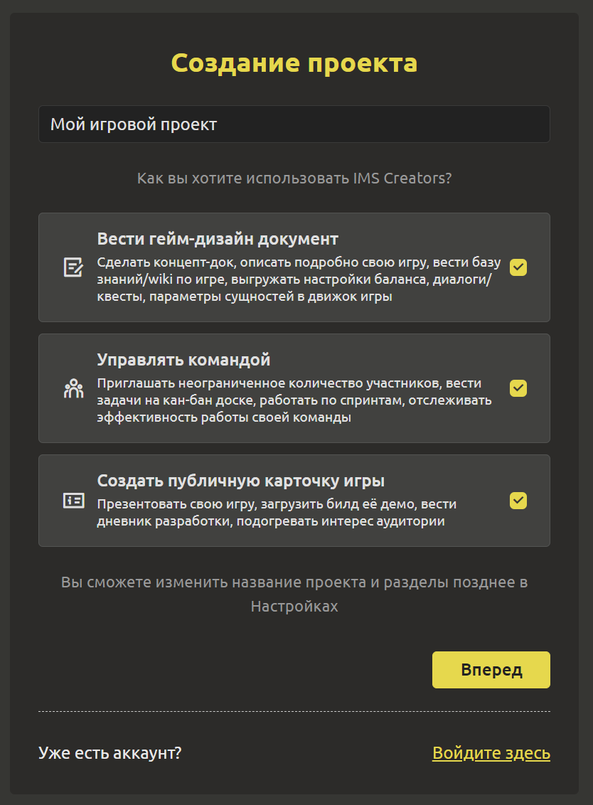
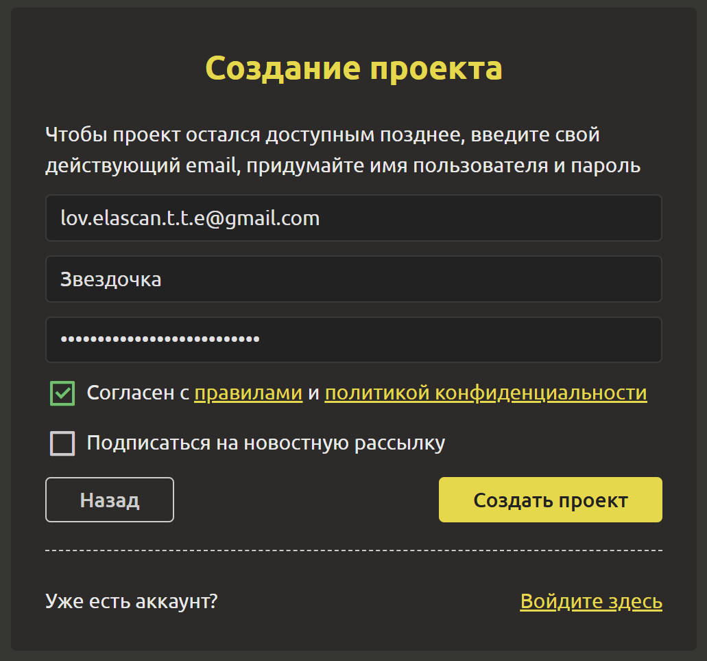
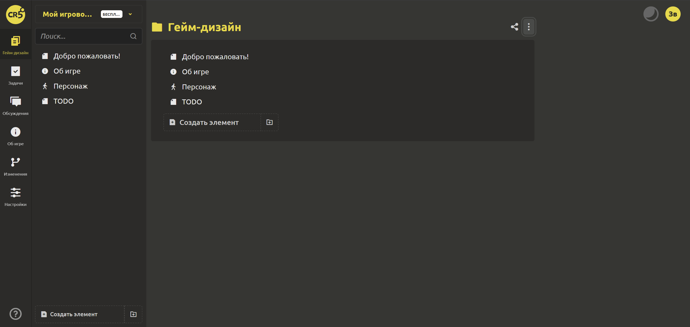
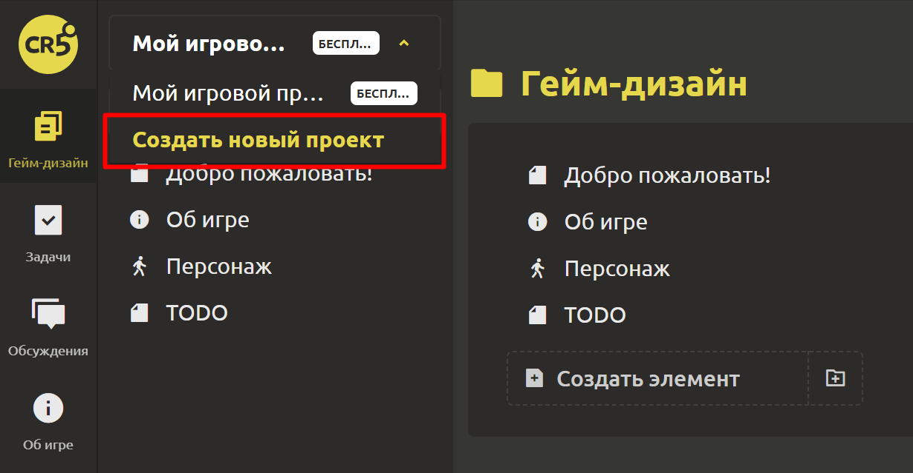
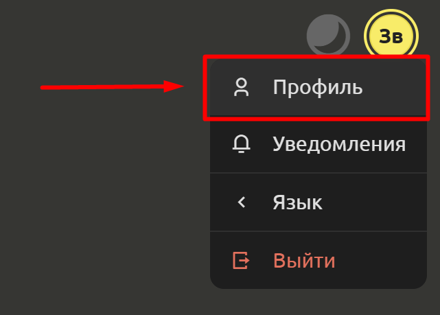
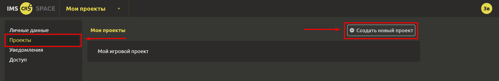

# Быстрый старт

## Регистрация и создание проекта

Попробуйте работать в IMS Creators в течение 24 часов без подтверждения почты! Для этого переходите по ссылке на главную страницу [IMS Creators](https://ims.cr5.space/ru) и кликай `Начните бесплатно`.

Откроется форма для создания проекта, где необходимо вписать название проекта и поставить галочки рядом с необходимыми для работы функциями:

1. **Вести гейм-дизайн документ**.

    Сделать концепт-док, описать подробно свою игру, вести базу знаний/wiki по игре, выгружать настройки баланса, диалоги/квесты, параметры сущностей в движок игры.

2. **Управлять командой**.

    Приглашать неограниченное количество участников, вести задачи на кан-бан доске, работать по спринтам, отслеживать эффективность работы своей команды.

3. **Создать публичную карточку игры**.

    Презентовать свою игру, загрузить билд её демо, вести дневник разработки, подогревать интерес аудитории.

::: tip
Вы сможете изменить название проекта и разделы позднее в Настройках
:::

Чтобы проект остался доступным позднее, введите свой **действующий** email, придумайте имя пользователя и пароль:

Не забудьте ознакомиться и согласиться с [правилами](https://ims.cr5.space/ru/terms) и [политикой конфиденциальности](https://ims.cr5.space/ru/privacy). После чего кликните на `Создать проект`.

Поздравляем!!! 🎈🎈🎈 Ваш первый проект успешно создан. Не забудьте перейти по ссылке из письма, отправленного на указанный email, чтобы подтвердить свой email.

## Добавление нового проекта

Количество создаваемых проектов не ограничено. Поэтому не останавливайтесь в своем творчестве, создавайте всё новые и новые игровые проекты легко и удобно разными способами:

1. С использованием левого меню.
Кликните на раздел "Гейм-дизайн", раскройте список игровых проектов в верхней части вкладки и выберите `Создать новый проект`.

2. Через личный кабинет пользователя.
В правом верхнем углу кликните на желтую кнопку с Вашим именем и в выпадающем списке выберите `Профиль`.

В профиле выберите пункт "Проекты" и кликните на кнопку `Создать новый проект`.

