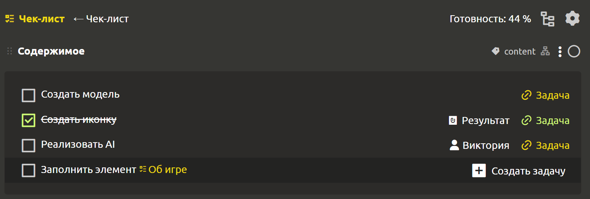
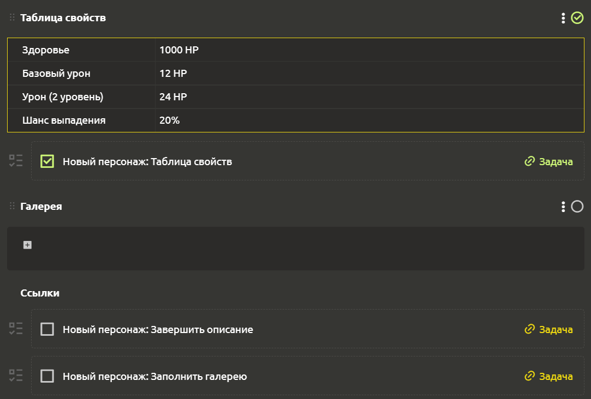
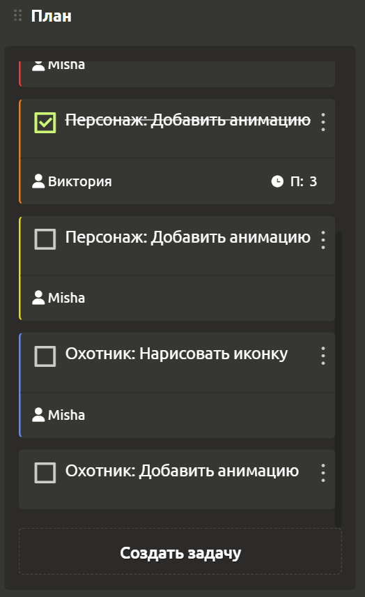

# Создание задач

Создавайте задачи там, где Вам будет удобно. На данный момент задачи можно создавать из чек-листа, элементов, блоков и канбан-доски.

## Из чек-листа

Для создания задачи из чек-листа выберите элемент, содержащий блок типа `Чек-лист`, и кликните на показывающуюся при наведении кнопку `+ Создать задачу`, расположенную справа от каждого пункта в чек-листе.

Откроется диалоговое окно со сгенерированным названием задачи, которое Вы можете изменить при желании.После нажатия на кнопку `Создать` откроется окно настроек задачи.

Если к задаче прикреплен участник, то данная информация будет отражаться справа от пункта внутри чек-листа. Для просмотра редактирования задачи достаточно кликнуть на `Задача` справа. Если задача выполнена, то она помечается зеленым цветом, иначе желтым.

## Прикрепление к блокам и элементам

Вы можете создавать задачи, привязывая их к блокам и элементам. Для этого следует кликнуть на многоточие в правом верхнем углу элемента (или блока) и выбрать пункт либо `Создать задачу`(для элемента), либо `Создать подзадачу`(для блока).

У элемента появится новый раздел `Ссылки`, расположенный под всеми блоками, где будут отражаться прикрепленные к элементу задачи. А подзадачи, прикрепленные к блоку, будут расположены под этим блоком.

## Из канбан-доски

Все задачи, созданные из чек-листа, а также прикрепленные к элементам и блокам, можно найти на канбан-доске на вкладке `Задачи`. Здесь задачи распределены по колонкам и даже отдельным доскам! Для создания задачи нужно нажать на кнопку `Создать задачу`, расположенную в нижней части интересующей колонки.

