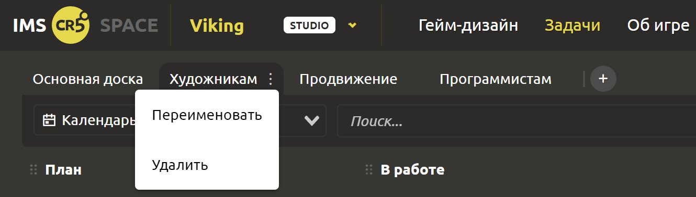
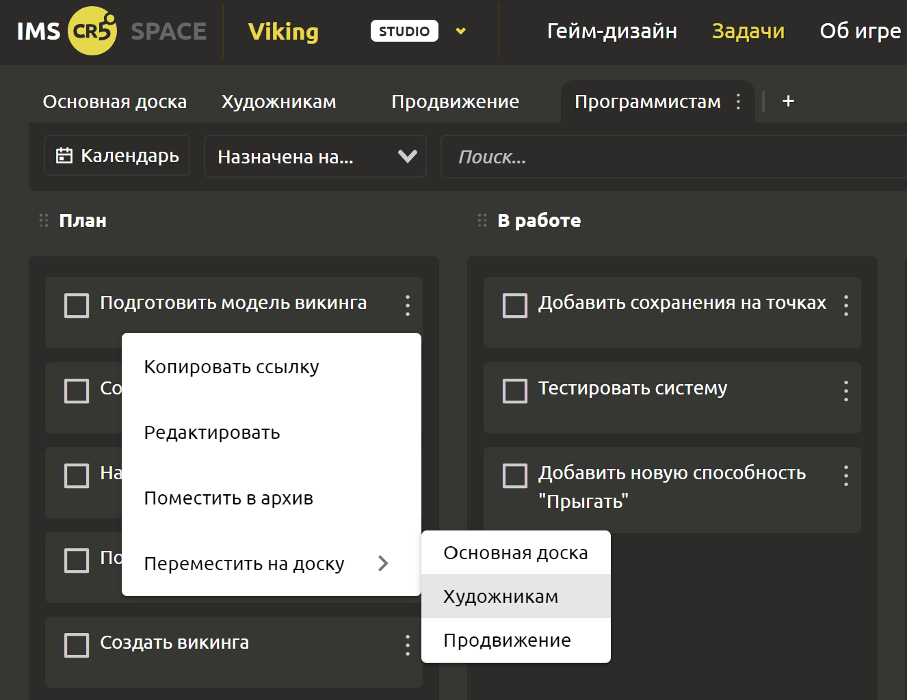

# Управление командой

## Создание кастомных досок

Если Вы руководитель какого-то отдела или всего игрового проекта (в общем, “не последний человек” в компании), то этот функционал растопит ваше сердечко) Настоящий task-tracker представляет Вам следующие возможности.

Задачи бывают разного плана. Например, они могут быть предназначены людям из разных отраслей (геймплей, звук, арт, продвижение и т.д.). Если хранить все задачи на одной доске, то будет очень сложно управлять. Кроме того, если вы работаете по спринтам, вы можете захотеть выделить задачи каждого из спринтов отдельно. Для обладателей лицензии “INDIE” и “STUDIO” мы предлагаем создание кастомных досок. Вы можете разбить вкладки по следующему принципу: Художникам, Продвижение, Программистам. Или по другому… Как Вам захочется, так и делайте) Для создания доски нажмите на “+” в верхней части страницы “Задачи”. 

## Перемещение задач

Задачи можно перемещать внутри колонок, между колонками и даже между досками!

::: tip
При перемещении задачи белой линией подсвечивается место, куда будет помещена задача. А на момент сохранения изменений сверху появится полоска прогресс-бара, чтобы можно было увидеть, что запрос обрабатывается.
:::

Задачи можно перемещать с одной доски на другую 2 способами:
1. Схватив задачу, перетащить её на нужную доску.
2. В 3 клика: нажать на точки справа -> выбрать “Переместить на доску” -> в выпадающем списке кликнуть на нужную доску.
