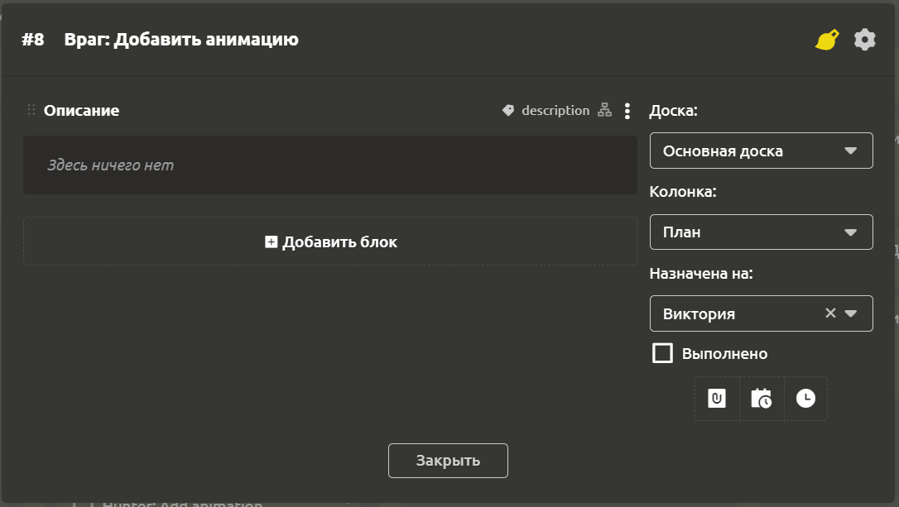

# Настройки задачи

Задачи в IMS Creators имеют гибкую структуру. Основные настройки можно редактировать в окне настроек.

## Шапка настроек

При двойном клике на название задачи, включается режим редактирования.

При нажатии на иконку `Кисть` в выпадающем меню можно выбрать цвет задачи. Этот цвет будет использован для выделения левого контура блока задачи внутри колонки.

При клике на шестеренку доступны следующие действия:
- `Копировать ссылку`
- `Переименовать`
- `Создать подзадачу`
- `Привязать к элементу`
- `Поместить в архив`

## Основной блок

По умолчанию создается блок `Описание`, где можно добавить подробности задачи. Здесь Вы можете создавать любые блоки.

## Правое меню

В правом меню расположены следующие поля:

- `Доска`
- `Колонка`
- `Назначена на`
- `Выполнено`

Ниже находятся кнопка, состоящая из 3 частей:

- `Запланировать задачу на`. Если задача, должна быть выполнена к какому-то сроку, то дату и время можно указать в появившемся сверху поле
- `Время`. Каждая задача требует трудозатрат. При нажатии на кнопку в шапке окна настроек появится секция для указания времени. Здесь можно указать плановую и фактическую трудозатраты в задачах. Это позволит равномерно планировать нагрузку на членов команды, а также своевременно реагировать на задержки по задачам.

Вы можете указать на какой доске и в какой колонке должна располагаться задача, а также назначить её исполнителя. После выполнения задачи следует пометить её выполненной с помощью галочки.
